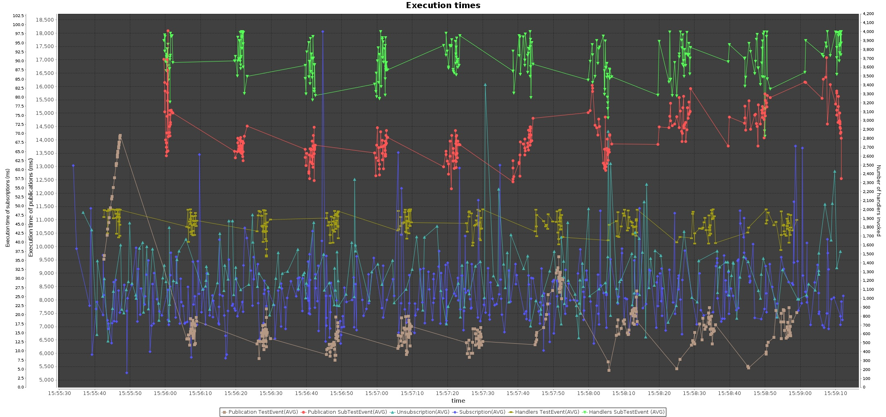

eventbus-performance
====================

This is a benchmark of some major (intra VM) event bus implementations for Java. The benchmark is based on [[lab]] and [[pips]].
Each benchmark is defined oblivious of the actual eventbus implementation that is being benchmarks, i.e. the results are comparable
without any restrictions. The results can be found in the projects "result" folder, the code is in "src" (surprise!).

After the initial implementation of some benchmark code that simply collected the overall execution times,
I found the time to write a more elaborate benchmarking library that allows a somewhat declarative configuration of
workloads that are subsequently executed by various executor services to provide high very high concurrency as normally found in,
for example, web servers, servlet containers or application servers.

There is a blog post comparing different event bus implementations and showing some of the benchmark results of the old code
(which can be found in "src/old" (<-surprise)

# Benchmarks

+ Each benchmark consists of a number of workloads, each workload defining a runnable task that will be executed concurrently depending on the workloads configuration
  + Workload "Publisher" publishes two batches (batch size= 1000) of events to the bus. TestEvent is the superclass of SubTestEvent and there are handlers that accept either an instance of TestEvent (including SubTestEvent as the handlers are polymorphic) or SubTestEvent. Each publisher is run multiple times according to workload configuration
  + Workload "Subscriber" continuously subscribes new listeners from a predefined set of listeners to the bus
  + Workload "Unsubscriber" continuously unsubscribes new listeners from the same predefined set of listeners to the bus. Listeners that have formerly been subscribed by "Subscriber" are available to the "Unsubscriber" threads for subsequent unsubcription
+ Depending on the scenario, different numbers of parallel tasks are executed to test different degrees of concurrency
+ Results of different task executions are collected during benchmark execution and a line graph as well as a textual report is generated after completion
+ The graphical representation of execution times allows a detailed comparison of the different bus implementation

## Read Write High Concurrency

+ 3 workloads
  + Publisher->Parallel tasks:30,start after 2 SECONDS,run 10 times
  + Subscriber->Parallel tasks:3,start immediately,run until Publisher ends
  + Unsubscriber->Parallel tasks:3,start after 5 SECONDS,run until Publisher ends

+ Parameters:
  + Delay after subscribing a single batch of listeners:30
  + Number of Unsubscriber threads:3
  + Number of batches to process with each publisher:10
  + Listener factory:ListenerFactory{1000 instances of SubTestEventListener | 1000 instances of TestEventListener | 1000 instances of AllEventsListener | }
  + Delay after unsubscribing a single batch of listeners:100
  + Number of publisher threads:30
  + Batch size per publisher:1000
  + Number of Subscriber threads:3

| Event Bus | Publication TestEvent | Publication SubTestEvent | Subscription | Unsubscription |
| ------------- |:-------------:|:-----:|:-----:|:-----:|
| Mbassador | ~1750 ms | ~3500 ms  | ~5 ms  | ~3 ms |
| Guava     | ~7000 ms | ~14000 ms | ~27 ms | ~30 ms |

Publication TestEvent: Deliver 1000 (batch size) messages (TestEvent) to 2000 handlers
Publication TestEvent: Deliver 1000 (batch size) messages (SubTestEvent) to 4000 handlers
Subscription: Subscribe 200 (1/5 batch size) listeners
Unsubscription: Unsubscribe 200 (1/5 batch size) listeners

## Read Write Low Concurrency

## Read Only High Concurrency
